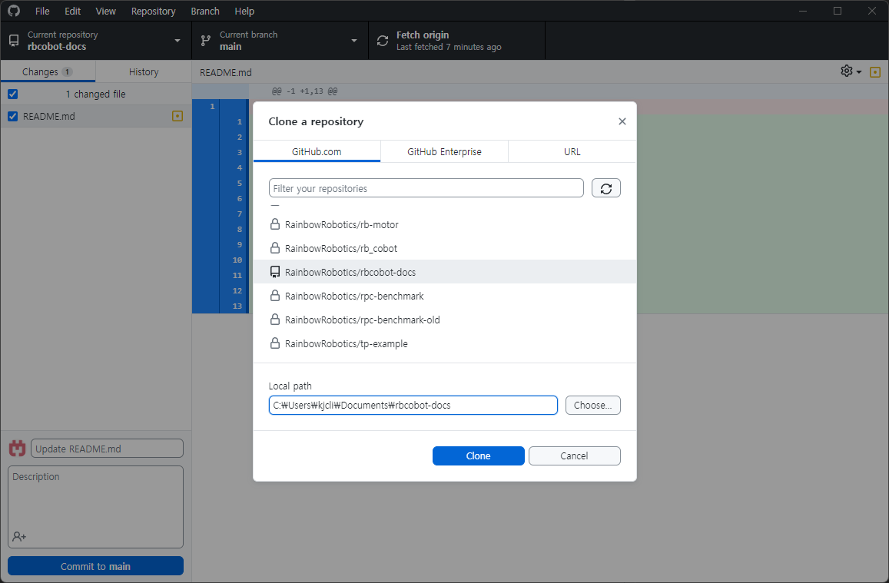

# rbcobot-docs

## 준비하기

1. Git 설치
https://git-scm.com/download/

2. (Optional) GitHub Desktop 설치
https://desktop.github.com/

3. (Optional) VSCode 설치
https://code.visualstudio.com/Download

4. NodeJS 설치
https://nodejs.org/en/download/current


## How To Run

### 1. Clone Repository
GitHub Desktop에서 File > Clone Repository > GitHub.com 탭 > RainbowRobotics/rbcobot-docs > 원하는 Local Path 설정 후 > 'Clone' 버튼 클릭




### 2. Open Reposity in VSCode

#### Extension 설치

Ctrl + Shift + X 누른 후 아래 extension 설치
- vue.volar
- vue.vscode-typescript-vue-plugin
- yzhang.markdown-all-in-one

아래 extension을 검색해서 'Disable (Workspace)' 를 눌러 제외함
- @builtin typescript-language-features

### 3. Run

In root direcotry, run the following script
```bash
$ npm install
$ npm run docs:dev
# or npm run docs:dev -- --host 0.0.0.0
```
